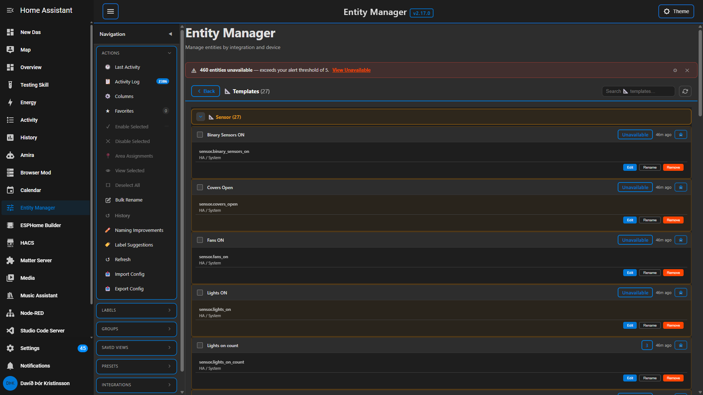
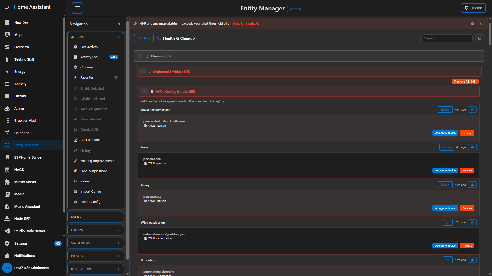

# Entity Manager for Home Assistant
A powerful, feature-rich Home Assistant integration for managing entities across all your integrations. View, enable, disable, rename, analyze, and bulk-manage entities and firmware updates from a single modern interface.


[](https://github.com/hacs/integration)

---
## Table of Contents
- [Features](#features)
  - [Entity Management](#entity-management)
  - [Entity Renaming](#entity-renaming)
  - [Search & Filtering](#search--filtering)
  - [Sidebar Navigation](#sidebar-navigation)
  - [Grouping](#grouping)
  - [Favorites](#favorites)
  - [Entity Aliases](#entity-aliases)
  - [Labels Integration](#labels-integration)
  - [Entity Comparison](#entity-comparison)
  - [Entity Analysis](#entity-analysis)
  - [Activity Log](#activity-log)
  - [Last Activity Timeline](#last-activity-timeline)
  - [Undo / Redo](#undo--redo)
  - [Filter Presets](#filter-presets)
  - [Column Customization](#column-customization)
  - [Devices View](#devices-view)
  - [Entity Detail Dialog](#entity-detail-dialog)
  - [Notification Center](#notification-center)
  - [Firmware Update Manager](#firmware-update-manager)
  - [Export & Import](#export--import)
  - [Theme System](#theme-system)
  - [Context Menu](#context-menu)
  - [Voice Assistant](#voice-assistant)
  - [Template Sensors](#template-sensors)
  - [Health & Cleanup View](#health--cleanup-view)
  - [Statistics Dashboard](#statistics-dashboard)
  - [Mobile & Responsive Design](#mobile--responsive-design)
- [Installation](#installation)
- [Usage](#usage)
- [Technical Details](#technical-details)
- [Screenshots](#screenshots)
- [Contributing](#contributing)
- [License](#license)
---
## Features
### Entity Management
- View all entities organized by **Integration > Device > Entity**
- Enable or disable individual entities with one click
- Bulk enable/disable with confirmation dialogs (up to 500 entities at once)
- Real-time entity state display with color-coded status badges
- Alphabetically sorted integrations for easy navigation
- Device grouping with entity counts per device and integration
- **Bulk Rename** (✎✎) and **Bulk Labels** (🏷️) buttons on every entity card — greyed out until 2+ entities are selected, then activate instantly as you check boxes
### Entity Renaming
- Click-to-rename any entity directly from the panel
- **Domain preservation** -- the `sensor.`, `light.`, etc. prefix is locked and stays intact
- **Automatic propagation** across automations, scripts, and helpers
- Conflict validation prevents duplicate entity IDs
- **Bulk Rename panel** — opens as a full-width inline view with a split layout: entity picker on the left (grouped by integration → device, collapsible, with per-group checkboxes) and the rename queue on the right
- **Live preview** in the queue — each entry shows the original entity ID, an editable new name field, and a live preview of the resulting ID (turns green when changed)
- **Find & Replace** at the top filters the entity picker in real time as you type; supports regex and case-sensitive matching
- **Domain preservation** — the `sensor.`, `light.`, etc. prefix is always locked
- **Automatic propagation** across automations, scripts, and helpers
- Conflict validation prevents duplicate entity IDs
### Search & Filtering
Entity Manager provides multiple ways to find exactly what you need:

| Filter Type | Description |
|---|---|
| **Fuzzy Search** | Smart search with fuzzy matching -- type "snr" to find "sensor", matches characters in order across entity IDs, names, integrations, and devices |
| **Text Search** | Instant search across entity IDs, names, integrations, and devices with real-time filtering |
| **Domain Filter** | Dropdown to filter by entity type (sensor, light, switch, binary_sensor, etc.) |
| **State Filter** | Toggle between All, Enabled, or Disabled with live entity counts |
| **Integration Filter** | Click an integration in the sidebar to show only its entities |
| **Label Filter** | Filter by Home Assistant labels |
| **Filter Presets** | Save and load your favorite filter combinations |

All filter buttons show **live counts** with color-coded indicators: green for enabled, red for disabled, amber for updates.
### Sidebar Navigation
A collapsible sidebar provides quick access to every feature:
- **Actions** -- **↺ History** (combined undo/redo timeline dialog), Export, Import, Favorites, **🕐 Last Activity** (recorder-backed timeline view), Activity Log, Comparison View, Column Settings; bulk selection actions: Enable Selected, Disable Selected, **Assign Area** (includes floor), View Selected, Deselect All
- **Labels** -- Browse and filter by Home Assistant labels grouped by **Devices**, **Areas**, **Automations**, **Scripts**, **Scenes**, and **Entities**
- **Groups** -- Switch between grouping modes: Integration (default), Room, Type, Floor, Device Name
- **Domains** -- Filter by entity domain
- **Integrations** -- Quick-filter list with integration icons from Home Assistant Brands
- **Help** -- Built-in two-column guide with clickable table of contents
Toggle the sidebar with the mobile menu button. Each section's collapse state is remembered between sessions.
### Grouping
Group entities by different criteria to get the view you need:
- **Integration** (default) -- organized by integration and device
- **Room / Area** -- grouped by Home Assistant area assignments
- **Type** -- grouped by entity domain (all sensors together, all lights together, etc.)
- **Floor** -- grouped by Floor → Area → Device hierarchy
- **Device Name** -- all devices with matching names merged into one group
Switch modes from the **Groups** sidebar section or with **Ctrl+G**. Your preference is saved between sessions.
### Favorites
- Star any entity to mark it as a favorite
- Dedicated **Favorites** filter in the sidebar shows only starred entities
- Favorites count displayed in the sidebar
- Add/remove via right-click context menu or bulk selection
- Persisted in browser local storage
### Entity Aliases
- Create custom display names for entities without renaming them
- Non-destructive -- the actual entity ID is unchanged
- Set aliases through the right-click context menu
- Persisted in browser local storage
### Labels Integration
- View and filter by **Home Assistant's built-in label system**
- Create new labels directly from Entity Manager
- Labels sidebar split into six sub-groups: **Devices**, **Areas**, **Automations**, **Scripts**, **Scenes**, **Entities** — only shown when labels of that type exist
- Clicking a label filters the main view, merging entity IDs from all matching groups
- **Label Suggestions** in the Suggestions dialog — 18 semantic categories (Lights, Dimmable Lights, Switches, Temperature Sensors, Motion Sensors, etc.); one-click "Apply to N" creates and assigns the label in HA
- Expandable list with refresh capability; label data cached for performance
### Entity Comparison
- Compare up to **4 entities side-by-side** in a table view
- View all properties and metadata for each entity
- Add entities via right-click context menu or sidebar
- Comparison counter shown in the sidebar
- Clear comparison with one click
### Entity Analysis
Right-click any entity to access deep analysis tools:
- **Impact Analysis** -- shows which automations reference the entity and would be affected by changes
- **Dependencies** -- displays all related automations and scripts
- **Statistics** -- detailed entity properties, metadata, and configuration
- **State History** -- view entity state changes over time
### Activity Log
- Reads **real Home Assistant state history** — shows every entity state change across your entire HA instance, not just Entity Manager actions
- Events grouped by **Room → Device → Entity** with three collapsible levels
- **Time range**: 1h (default), 6h, 24h, 7d
- **Search bar** filters by entity ID, device, room, or state value
- **Room filter chips** with All / None buttons — select specific rooms to focus on; selection persisted between sessions
- Accessible from the Actions sidebar section
### Last Activity Timeline
A dedicated inline view showing **recorder-backed "last active" timestamps** for every entity, automation, script, helper, template, and more — in one consolidated, searchable, filterable list:
- **🕐 Last Activity** button in the Actions sidebar section opens the full inline view
- Entities split into **15 domain-based sections**: 🤖 Automations, ⚡ Scripts, 🎛️ Helpers, 🧩 Templates, 💡 Lights, 🔌 Switches, 🌡️ Sensors, 🔍 Binary Sensors, 📺 Media Players, ❄️ Climate & Environment, 🔒 Security, 📷 Cameras, 📍 People & Tracking, 🔘 Controls, ⬆️ Updates, ⚙️ Other (sub-grouped by integration)
- **9 time-range filter pills**: All · Today · This Week · 1 Month · 3 Months · 6 Months · 1 Year · Older · Never — filter selection persisted between sessions
- **Live search** across entity ID, friendly name, device name, and integration with 200ms debounce
- **Live count badge** in the header updates as you filter/search
- Timestamps come from the **HA recorder database** — survive HA restarts (unlike in-memory `last_changed` which resets when entities briefly go unavailable)
- Automations and scripts use `last_triggered` from HA state attributes
- Refresh button invalidates the 1-hour localStorage cache and fetches fresh recorder data
- Clicking any row opens the full entity detail dialog
### Undo / Redo
Full operation history with combined timeline dialog:
- **↺ History** button in the sidebar opens a combined undo/redo timeline dialog
- Shows the full action history: redo actions (top, muted) → current state divider → undo actions (bottom)
- Click any row in the dialog to jump to that point in history; the list refreshes in-place
- **Clear History** button wipes both stacks
- **Ctrl+Z** to undo the last operation; **Ctrl+Shift+Z** or **Ctrl+Y** to redo
- Supports: enable, disable, rename, display name change, label changes, device/area assignment, and all bulk operations
- History survives page refresh (localStorage persistence)
### Filter Presets
- Save your current filter configuration (domain, search term, state) as a named preset
- Load any saved preset to instantly restore a filter combination
- Delete presets you no longer need
- Quick-access buttons for each saved preset
### Column Customization
Choose which columns to display in the entity table:
- Entity ID
- State
- Device
- Entity Category
- Disabled By
- Automations Count
- Alias
Toggle columns from the sidebar **Columns** button. Preferences are saved between sessions.
### Devices View
A dedicated **Devices** tab shows all devices sorted alphabetically and organised by category:
- Devices with the same display name are **merged into a single group** — useful for Shelly multi-relay devices where all channels share one name
- Every device (and same-name group) is split into standard HA category cards: **⚡ Controls**, **📊 Sensors**, **⚙️ Configuration**, **🔧 Diagnostic**, **📡 Connectivity**
- Each category card shows entity count, enabled/disabled breakdown, and its own **Enable All / Disable All** buttons
- Cards are independently collapsible — opening one never affects others
- Entities whose device has a `configuration_url` show a **🔗** button to open the device web UI in a new tab

### Entity Detail Dialog
Click any entity card (not a button or checkbox) to open a full detail dialog with everything Home Assistant knows about that entity.

**Hero Header** — the top of the dialog shows:
- Friendly name with inline pencil to rename (saves via `update_entity_display_name`; cancel with ✕, Escape, or click outside)
- Entity ID in monospace below the name
- Chip row: domain (blue border), platform, Disabled badge (if applicable), Area name
- State displayed as a colour-coded pill (green for on/open, orange for unavailable/unknown, grey for off) with a **"State" label** prefix
- Last changed / Last updated timestamps in locale-aware absolute format (12h/24h and date order follow your browser locale)
- **Toggle / Press** button inline for controllable entities (switch, light, fan, cover, automation, etc.) and button/script entities

**Collapsible Sections** (all use flat label → value rows, not cards):

| Section | Contents |
|---------|----------|
| **Attributes** | All state attributes in a 2-column grid — open by default |
| **Registry** | Entity category, device class, disabled/hidden state, icon, unit, unique ID, supported features |
| **Device** | Manufacturer, model, SW/HW version, serial number, config URL, connections |
| **Integration** | Config entry title, domain, source, version, state |
| **Area & Labels** | Assigned area shown as bordered chips; all HA labels attached |
| **State History** | Compact timeline of state changes: coloured dot + state value + absolute timestamp |
| **Dependencies** | Automations and scripts that reference this entity |

**Footer Action Buttons:**
- **Copy ID** — copies entity ID to clipboard with a toast confirmation
- **Enable / Disable** — toggles entity state and closes the dialog
- **Open in HA** — opens the entity's HA settings page in a new tab
- **Close**

### Notification Center
A live notification feed built into the panel header:
- **Bell icon** (🔔) sits right of the panel title — a red badge shows unread count; the icon fills to `mdi:bell-badge` when unread items exist
- Clicking the bell opens a dropdown listing all notifications newest-first
- **Four tracked event types:**
  - **Device offline** (red) — fires when any entity transitions to `unavailable`
  - **State anomaly** (orange) — fires when an entity transitions to `unknown` from a known state
  - **Entity enabled / disabled** (green / red) — detected on each data refresh by comparing states between loads
  - **New entity** (blue) — fires when a new entity ID appears in the registry
- **Persistent** — stored in `localStorage`, survives page refreshes and HA restarts
- **Rate-limited** — same entity + event type fires at most once per 5 minutes (prevents spam on flapping devices)
- **Capped** at 100 entries — oldest dropped when the limit is reached
- **Mark all read**, **dismiss individual**, and **clear all** controls
- **Gear icon** opens per-type preference toggles — silence any event type individually
- **Click any notification** to open the full Entity Detail Dialog for that entity
- **EM-action suppression** — enable/disable actions performed inside Entity Manager itself do not generate notifications

### Firmware Update Manager
A dedicated **Updates** tab to manage all firmware and software updates:
- View all available updates in one place
- **Filter by stability**: All Updates, Stable Only, Beta Only
- **Filter by category**: All Types, Devices Only, Integrations Only
- **Hide up-to-date** checkbox to focus on pending updates
- **Select All** pill with expanding **Update Selected** button — animates into view when items are selected
- View **release notes** before updating
- **Sequential bulk updates** — runs one at a time for safety; rows progress through Queued → Active → ✓ Updated / ✕ Failed
- **Live progress ring** — SVG ring tracks exact `update_percentage` when HA reports it; indeterminate spinner otherwise
- **HA auto-backup banner** — shows and toggles HA's global "backup before update" setting; green when ON, red when OFF; hidden on plain HA Core
- **Per-entity Backup checkbox** — shown for entities that support backup; "Backup All" header checkbox for bulk selection
- Alphabetical sorting by title; live update count on filter button
### Export & Import
- **Export entity configurations** to JSON -- includes enabled/disabled states for all entities
- **Import configurations** from a previously exported JSON file to restore states
- **Export/Import custom themes** separately
- Date-stamped export files for easy versioning
- Access from the sidebar or **Ctrl+E**
### Theme System
Entity Manager ships with a comprehensive theming engine:
**4 Built-in Themes:**
1. **Default** -- follows your Home Assistant theme
2. **Dark** -- dedicated dark mode
3. **High Contrast** -- optimized for accessibility
4. **Purple** -- alternative color scheme
**Custom Theme Editor:**
- Create unlimited custom themes with a visual color picker
- Customize every color: primary, success, danger, warning, text, backgrounds, borders, shadows
- **Background image support** with adjustable overlay opacity
- Light/dark mode toggle per theme
- Real-time preview with color chips
- Import/export themes as JSON to share with others
**Automatic Mode:**
- Detects Home Assistant light/dark mode
- Respects system color scheme preferences
- Manual override available per theme
**Stat Card Color Accents:**
- Every stat card has a unique colored **top-border accent** and **subtle tinted background** — both in light and dark mode
- Text colors automatically compensate so labels and values are always readable against their tinted background
- Works correctly in mixed-mode setups (e.g. HA dark + EM light or EM dark + HA light)
### Context Menu
Right-click any entity (or multi-selection) for a full context menu:
**Single entity:**
- Rename / Enable / Disable
- Add to Favorites
- Manage Labels / Alias
- **Assign to area** — two-panel dialog: select floor (step 1) to label new area creation, then pick from all areas (step 2); live preview shows new area + floor; "No area" option clears assignment
- **🔌 Assign to device** — opens an integration-grouped device picker with confirmation; stored in undo history with device name
- Add to Comparison
- View Statistics / State History
- Show Dependencies / Analyze Impact
- Copy Entity ID
- Open in Home Assistant
**Multiple entities selected:**
- Bulk Rename (with regex)
- Bulk Enable / Disable
- Bulk Add to Favorites
- Bulk Add Labels
- Bulk Compare
- Clear Selection

### Voice Assistant
Control Entity Manager hands-free with voice commands:
- *"Enable entity {name}"*
- *"Disable entity {name}"*
- *"Activate entity {name}"*
- *"Deactivate entity {name}"*
- *"Registry enable/disable {name}"*
Voice commands enforce admin-only access for safety.

### Template Sensors
Entity Manager exposes template sensors for entity statistics and automation conditions:

**Available Template Sensors:**
```yaml
template:
  - sensor:
      - name: Entity Manager Disabled Entities
        unique_id: entity_manager_disabled_count
        state: "{{ states.entity_manager.disabled_entity_count | default(0) }}"
        unit_of_measurement: entities
        state_class: measurement
        icon: mdi:checkbox-marked-outline

      - name: Entity Manager Enabled Entities
        unique_id: entity_manager_enabled_count
        state: "{{ states.entity_manager.enabled_entity_count | default(0) }}"
        unit_of_measurement: entities
        state_class: measurement
        icon: mdi:checkbox-blank-outline

      - name: Entity Manager Total Entities
        unique_id: entity_manager_total_count
        state: "{{ states.entity_manager.total_entity_count | default(0) }}"
        unit_of_measurement: entities
        state_class: measurement
        icon: mdi:layers

      - name: Entity Manager Disabled Entities by Integration
        unique_id: entity_manager_integration_stats
        state: "{{ states.entity_manager.integration_disabled_stats | default('{}') }}"
        icon: mdi:layers-multiple
```

**Using in Automations:**
```yaml
automation:
  - alias: "Alert on too many disabled entities"
    trigger:
      - platform: numeric_state
        entity_id: sensor.entity_manager_disabled_entities
        above: 100
    action:
      - service: persistent_notification.create
        data:
          title: "Entity Manager Alert"
          message: >
            {{ trigger.to_state.state }} entities are currently disabled.
            Consider reviewing in Entity Manager panel.
```

**JSON Sensor for Advanced Tracking:**
```yaml
template:
  - sensor:
      - name: Entity Manager Export
        unique_id: entity_manager_export
        state: "{{ now().isoformat() }}"
        attributes:
          disabled_entities: "{{ state_attr('sensor.entity_manager_export', 'disabled_entities') }}"
          by_integration: "{{ state_attr('sensor.entity_manager_export', 'by_integration') }}"
          by_domain: "{{ state_attr('sensor.entity_manager_export', 'by_domain') }}"
```

### Statistics Dashboard
The toolbar displays live stats for your Home Assistant instance:
- **Integration count** - Total number of integrations
- **Device count** - Total number of devices
- **Total entity count** - Clickable to open a grouped entity list (Integration → Device) — click any entity row to open its full detail dialog
- **Automation count** - Clickable to view automations list with last-triggered time and edit navigation
- **Script count** - Clickable to view scripts list
- **Helper count** - Clickable to view input helpers and variables
- **Template count** - Clickable to view template entities with state, last active, and edit/remove actions
- **HACS count** - Clickable to browse your HACS store and installed integrations
- **Lovelace Cards count** - Clickable to inspect dashboards, card type distribution, and entity references
- **Update count** - Amber-highlighted when updates are available; clickable to open the Updates view

All counts update in real-time as you make changes.

### Stat Card Dialogs — Mini Entity Cards
Every stat card opens a dedicated dialog where items are displayed as **mini entity cards** matching the visual style of the main view:
- Dark header band showing the friendly name, state chip (On/Off/Running/unavailable/…), and time-ago
- Monospace entity ID in the body with domain or mode info below
- Action buttons (Edit, Rename, Toggle, Remove…) in a row at the bottom
- **Search bar is pinned in the dialog header** — always visible, never scrolls away
- First section expands automatically so content is visible without any extra clicks
- Colour-tinted section backgrounds make different categories instantly recognisable; alternating row tints aid readability in long lists

Each card has a **↗ button** that takes you directly to the right place in HA:
- **Automations** → opens the automation editor for that automation
- **Scripts** → opens the script editor
- **Everything else** → opens the HA more-info popup for the entity

Bulk checkboxes, Rename, and Label assignment work inside dialogs the same as in the main view.

### Health & Cleanup View
The **Health & Cleanup** inline view surfaces housekeeping tasks across five sections:
- **Unavailable entities** — entities currently in `unavailable` state; per-row actions: **Ignore** (with snooze), **Disable**, **Add to Group**, **Remove**; Disable and Remove show a confirmation dialog; **Show ignored (N)** toggle in the section header
- **Orphaned entities** — entities with no parent device (YAML remnants or integration leftovers); grouped by integration; per-row actions: **Ignore** (with snooze), **Assign to device**, **Add to Group**, **Remove**; **Show ignored (N)** toggle
- **Stale entities** — entities with no state change in 30+ days; grouped by domain; Keep (hide for 30 d), Disable, or Remove per entity
- **Ghost devices** — devices registered in HA but with zero entities; Remove
- **Never triggered** — automations and scripts that have never been triggered

**Ignore with Snooze**: clicking Ignore opens a duration picker — 1 Day / 3 Days / 1 Week / 2 Weeks / 1 Month / 3 Months / Permanent. Snoozed entities are hidden until the snooze expires; permanently ignored entities stay hidden until you click Unignore. The ignored state is shared between the inline view and the individual stat card dialogs.

**Add to Group**: opens a dialog with all five grouping modes from the sidebar — By Area, By Floor, By Device Name, By Integration, By Type — plus any custom groups you've created. By Area and By Floor open the two-panel area assignment dialog; By Device Name opens the device picker.

### Suggestions Dialog
Five colour-coded sections help you improve your entity setup:
- 🟣 **Health Issues** (purple) — entities unavailable for 7+ days → suggested for disable
- ⬜ **Disable Candidates** (neutral) — diagnostic entities unchanged for 30+ days
- 🟠 **Naming Improvements** (orange) — entities with auto-generated hashes or generic names
- 🔴 **Area Assignment** (red) — devices with no area assigned — bulk-assign directly from the dialog
- 🟡 **Label Suggestions** (amber) — smart HA label recommendations — click *Apply to N* to create and assign instantly

Each section has its own colour tint on the header, body, device groups, and entity rows for quick visual scanning.

### Mobile & Responsive Design
Three-breakpoint responsive layout designed and tested on real Android phones:

| Breakpoint | Target | Key changes |
|---|---|---|
| ≤768px | Tablets | Sidebar becomes overlay, stat cards 3-per-row, device headers wrap; action buttons scale to 13px |
| ≤600px | Medium phones (~540px) | Entity list 1-column, action buttons wrap with 36px touch targets |
| ≤480px | Small phones | Further font/padding reductions (11px), mini cards stack to 1-column |

- Collapsible sidebar with dedicated mobile toggle button; tap outside to close
- Stat cards always show **3 per row** on mobile — labels never truncated
- Device card headers wrap bulk actions and area button to a second line on narrow screens; buttons compact to fit without overflowing or truncating
- Dialog padding scales down at each breakpoint so dialogs use screen space efficiently
- All touch targets minimum 36×36px on mobile
---
## Installation
### HACS (Recommended)
1. Open **HACS** in Home Assistant
2. Go to **Integrations**
3. Click the three dots menu in the top right
4. Select **Custom repositories**
5. Add `https://github.com/TheIcelandicguy/entity-manager` as an **Integration**
6. Click **Install**
7. Restart Home Assistant
### Manual Installation
1. Download the `custom_components/entity_manager` folder from this repository
2. Copy it to your Home Assistant `custom_components` directory
3. Restart Home Assistant
---
## Usage
### Getting Started
1. After installation, go to **Settings > Integrations > Add Integration**
2. Search for **Entity Manager** and add it
3. The **Entity Manager** panel will appear in your Home Assistant sidebar
4. Click it to open the full management interface
### Managing Entities
- **Expand an integration** to see all its devices and entities
- Click the **checkmark** to enable or the **X** to disable an entity
- Use **Enable All / Disable All** buttons for entire integrations
- **Select multiple entities** with checkboxes, then use bulk actions in the toolbar
### Renaming Entities
1. Click the **pencil icon** next to any entity
2. Edit the name (the domain prefix is locked)
3. Click **Rename** to confirm
4. The change automatically propagates across all automations, scripts, and helpers
### Using Filters
- Pick a **domain** from the dropdown to narrow by entity type
- Type in the **search box** to find entities by name, ID, or integration
- Click **Enabled / Disabled / Updates** buttons to filter by state
- Click an **integration** in the sidebar to show only its entities
- Use **#tagname** in search to find tagged entities
### Managing Updates
1. Click the **Updates** filter button in the toolbar
2. Use the filter dropdowns to narrow by stability or category
3. Check the **HA auto-backup banner** to confirm your global backup setting is correct
4. Optionally check the **🛡 Backup** checkbox on rows you want backed up before updating
5. Check **Select All** (or pick individual rows) — the **Update Selected** button expands to the right
6. Click **Update Selected**; each row progresses through Queued → Active (progress ring) → ✓ / ✕
---
## Technical Details
### Requirements
- **Home Assistant** 2024.1.0 or later
- Modern web browser with ES6+ support
- Admin user account (all operations require admin privileges)
### Architecture
```
Frontend (Vanilla JS Web Component)
         | WebSocket
Backend (Python WebSocket API)
         |
Home Assistant Entity & Device Registries
```
### Components
| Component | Description |
|---|---|
| `__init__.py` | Integration setup, service registration, sidebar panel |
| `websocket_api.py` | 19 WebSocket command handlers |
| `voice_assistant.py` | Voice intent handlers |
| `config_flow.py` | UI-based configuration flow |
| `entity-manager-panel.js` | Full frontend as a single web component |
| `entity-manager-panel.css` | Extracted stylesheet |
### WebSocket API
All commands require admin privileges.

| Command | Parameters | Description |
|---|---|---|
| `entity_manager/get_disabled_entities` | `state`: disabled, enabled, or all | Entities grouped by integration/device |
| `entity_manager/export_states` | — | Export all entity states to JSON |
| `entity_manager/get_automations` | — | Automations with last-triggered and trigger context |
| `entity_manager/get_template_sensors` | — | Template entities with state + connections |
| `entity_manager/get_entity_details` | `entity_id` | Full entity metadata (registry, device, area, labels) |
| `entity_manager/get_config_entry_health` | — | Failed/unhealthy config entries |
| `entity_manager/get_areas_and_floors` | — | Area + floor hierarchy |
| `entity_manager/list_hacs_items` | — | Installed HACS items + store items |
| `entity_manager/get_last_activity` | `entity_ids` (optional) | Recorder-backed last-active timestamps per entity |
| `entity_manager/enable_entity` | `entity_id` | Enable a single entity |
| `entity_manager/disable_entity` | `entity_id` | Disable a single entity |
| `entity_manager/bulk_enable` | `entity_ids` (max 500) | Enable multiple entities |
| `entity_manager/bulk_disable` | `entity_ids` (max 500) | Disable multiple entities |
| `entity_manager/rename_entity` | `entity_id`, `new_name` | Rename entity (domain preserved) |
| `entity_manager/update_entity_display_name` | `entity_id`, `display_name` | Set or clear user display name |
| `entity_manager/remove_entity` | `entity_id` | Remove entity (handles templates, YAML, integration-managed) |
| `entity_manager/update_yaml_references` | `old_entity_id`, `new_entity_id`, `dry_run` | Find/replace entity ID across YAML config files |
| `entity_manager/assign_entity_device` | `entity_id`, `device_id` | Assign entity to a device |
| `entity_manager/unassign_entity_device` | `entity_id` | Remove device assignment from entity |
### Home Assistant Services
- `entity_manager.enable_entity`
- `entity_manager.disable_entity`
- `entity_manager.bulk_enable`
- `entity_manager.bulk_disable`
- `entity_manager.rename_entity`
- `entity_manager.export_states`
### Local Storage Keys
Entity Manager stores user preferences in the browser:
| Key | Data |
|---|---|
| `em-favorites` | Starred entities |
| `em_activityLog` | Last 100 operation log entries |
| `em_undoStack` | Up to 50 undo steps (survives page refresh) |
| `em_redoStack` | Redo steps |
| `em-custom-themes` | User-created themes |
| `em-active-theme` | Currently selected theme |
| `em-entity-aliases` | Entity display aliases |
| `em-activity-watch` | Activity Log room filter selection |
| `em-sidebar-sections` | Sidebar section open/closed states |
| `em-filter-presets` | Saved filter combinations |
| `em-visible-columns` | Column visibility preferences |
| `em-sidebar-collapsed` | Sidebar state |
| `em-smart-group-mode` | Active grouping mode |
| `em-entity-order` | Custom entity ordering |
| `em_lastActivityCache` | Recorder-backed timestamps (1-hour TTL) |
| `em-at-filter` | Last Activity Timeline active filter pill |
---
## Screenshots

### Main Panel

| Light Theme | Dark Theme |
|:---:|:---:|
|  |  |

| Front View |
|:---:|
|  |

### Last Activity Timeline


### Undo / Redo History


### Themes

| HA Default | High Contrast | OLED | Theme Editor |
|:---:|:---:|:---:|:---:|
|  |  |  |  |

### Entity Cards

| Integration View | Devices View |
|:---:|:---:|
|  |  |

### Bulk Rename


### Devices View


### Automations, Scripts & Helpers

| Overview | Open |
|:---:|:---:|
|  |  |

### Templates



### Assign to Device

| Picker | Confirmation |
|:---:|:---:|
|  |  |

### Updates


### HACS Store


### Card Types

| Card Types | Card Types (expanded) |
|:---:|:---:|
|  |  |

### Cleanup & Health

| Cleanup | Cleanup & Health | Cleanup & Health (expanded) |
|:---:|:---:|:---:|
|  |  |  |

### Suggestions


---
## Use Cases
- **Cleaning up after integrations** -- disable the dozens of unused entities that some integrations create
- **Organizing large systems** -- manage hundreds of entities efficiently with filters, tags, and groups
- **Standardizing naming** -- bulk rename entities with regex to fix naming conventions across your setup
- **Troubleshooting** -- analyze entity dependencies and automation impact before making changes
- **Performance optimization** -- disable unnecessary entities to reduce system load
- **Firmware management** -- keep all devices and integrations up to date from one screen
- **Backup & restore** -- export entity configurations before major changes, import to roll back
---
## Troubleshooting
### Panel Not Showing
- Ensure the integration is added via **Settings > Integrations**
- Check that your user has **admin privileges**
### Frontend Not Updating
- Clear your browser cache (Ctrl+Shift+R)
- Check the browser console for JavaScript errors
### Debug Logging
Add to your `configuration.yaml`:
```yaml
logger:
  default: info
  logs:
    custom_components.entity_manager: debug
```
---
## Contributing
Contributions are welcome! Please feel free to submit a Pull Request.
## License
This project is licensed under the MIT License -- see the [LICENSE](LICENSE) file for details.
## Author
**TheIcelandicguy**
- GitHub: [@TheIcelandicguy](https://github.com/TheIcelandicguy)
## Acknowledgments
- Home Assistant community for inspiration and support
- [Home Assistant Brands](https://github.com/home-assistant/brands) for integration icons
- All contributors and users of Entity Manager
---
**If you find this integration helpful, please consider giving it a star on GitHub!**
